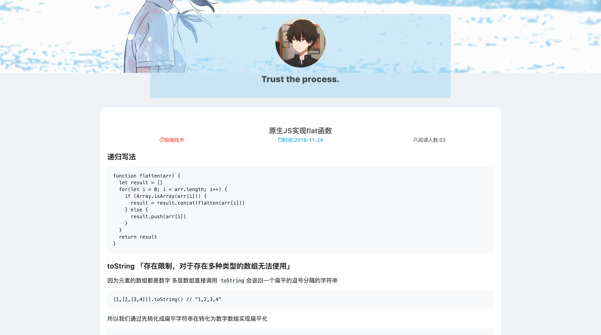
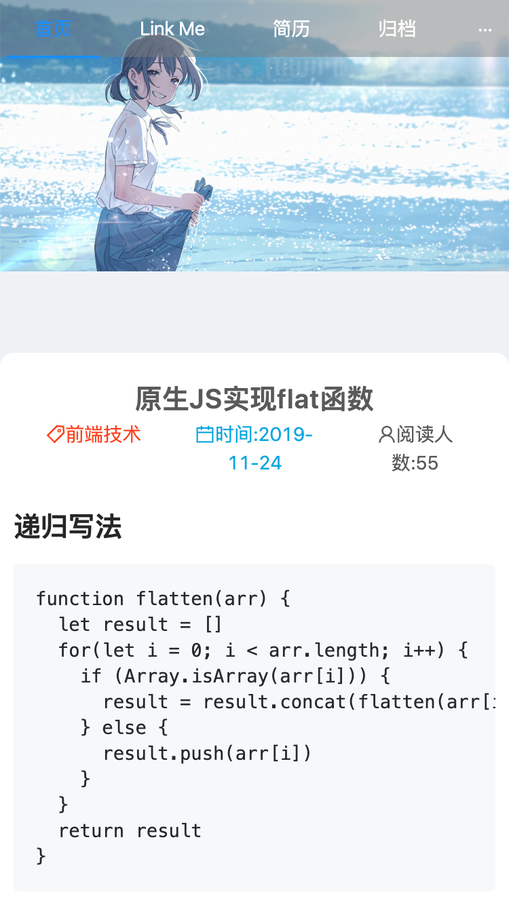
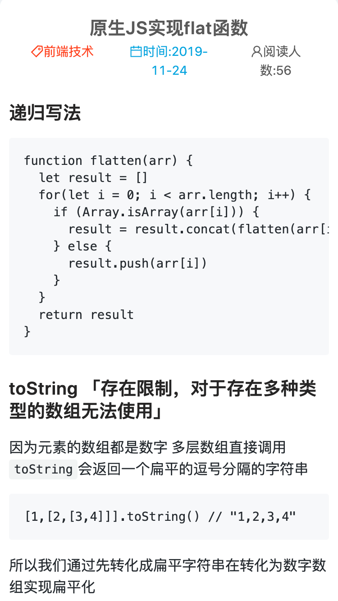

<h1 align="center">
  
  <p align="center" style="font-size: 0.8em">The Blog</p>
  <p align="center" style="font-size: 0.5em">A System to build your own blog site.</p>
</h1>

[](https://github.com/Reaper622/TheBlog/blob/master/LICENSE)   [](https://github.com/Reaper622/TheBlog/stargazers)

A system to build your own blog site.

修改一个配置文件，即可搭建出你自己的博客平台。

线上演示地址: [reaperlee.cn](http://www.reaperlee.cn)

### 预览图
- PC端首页


- PC端文章页



- 移动端首页



- 移动端文章页




### 使用环境

- node  >= v8
- mysql
- npm
- React脚手架基于 [**MisLab-React-Cli-SinglePage**](https://github.com/mis-lab/MisLab-React-Cli-SinglePage)


### 如何使用？

- clone 本仓库

```
git clone git@github.com:Reaper622/TheBlog.git
```

- 安装依赖

```
npm install
```

- 执行初始化命令

```
npm run init
```

- 根据`config.sample.js`完成对 MySQL数据库的配置，完成后修改文件名为`config.js`
- 修改`config.json`内部分自定义设置
- 在 `articles`文件夹下创建文档目录

```
articles/
|-- label 标签
     |-- year 年份
         |-- month 月份
             |-- day 日期
                 |-- filename 文件
```

- 在数据库中创建数据表，执行`createSQL.sql`
- 执行打包命令

```
npm run build
```
- 如要使用 HTTPS 服务则提前将SSL证书的 ssl.crt 与 ssl.key 存放在 server/ssl 目录中
- 执行服务端运行指令

```
npm run server // http
npm run server:ssl // https
```

- 访问 [localhost:4000](locahost:4000) 即可访问 


## 使用 Github Actions 进行 CI/CD
只需要给自己的仓库添加相应的 secret,并修改`.github/workflow/depoly.yml`文件相关配置,即可实现`git push`之后一键同步到远程服务器。

